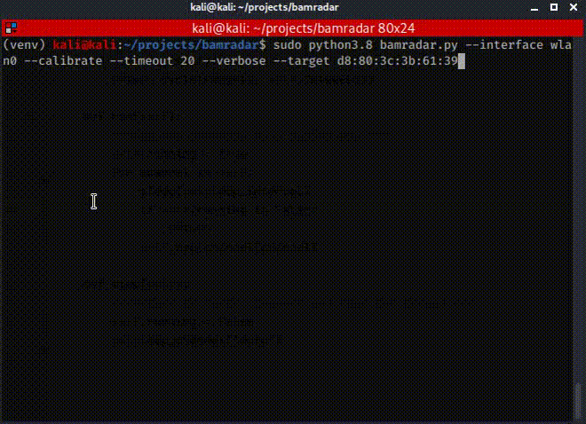
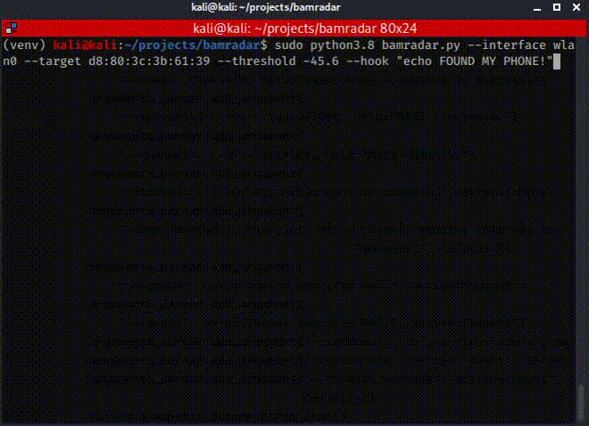

# bamradar
######  Detect wifi devices in classified areas.
Bamradar is a sniffer that monitors and detects 
wifi devices. The tool generates a specific RSSI threshold, 
every sniffed packet that has bigger RSSI value 
will be alerted.
 
##### Prerequisite
* Linux OS (Kali is recommended).
* Wifi Adapter that supports monitor mode.
* Python 3.8.
  
#### So how it will work?
###### STAGE 1 - Calibrate the tool.
Calibrate the tool and search for compatible threshold. 
You should walk in the specific area, near the walls and the
far corners in the room, 
measure the RSSI values that your
specific phone signals (Sniff and filter on your specific MAC with bamradar).
In expirements we saw that walls (different types) and windows affect the RSSI value and causes a 
percieved decrease in the signal strength. With this method we can be sure
that we didn't received frame from another room. Also,
the threshold has safety factor to ensure that we won't get
devices from another rooms. If the measured/chosen threshold
is small enough, the detection will be more accurate.
 
This command will record the RSSI values of 
frames of specific smartphone and prints 
calculated threshold.

`python3.8 bamradar.py --interface INTERFACE --calibrate --target TARGET_MAC
 --verbose`
  
If your phone has randomised MAC you can run the 
program without target, be aware that the threshold
will be calculated by all the signals that transmitted
around. Get sterile wifi devices environment.  
`python bamradar.py --interface INTERFACE --calibrate --verbose`

It can also possible to calibrate with timeout:

`python bamradar.py --interface INTERFACE --calibrate --verbose --timeout 10`

The tool takes the maximum RSSI value that have measured and print it.
Define it as your **threshold**.

###### STAGE 2 - Monitor devices.
Now we need to take our threshold value and pass it to
the bamradar program. The program will alert when
device with strong signal will be detected.
 
NOTE: Don't forget to filter your own wireless interfaces.
It will spam the bamradar and will show a ghost devices
with strong signal strength. 
  
`python3.8 bamradar.py --interface INTERFACE --threshold RSSI_VALUE --ignore
 IGNORED_MAC`
 
There is option for alert hook. If the bamradar found a
wifi device, it can alert with the logging and also with specific hook that the
 user defined. The hook is a shell command the will executed
 when the bamradar alerting.

`python3.8 bamradar.py --interface INTERFACE --threshold RSSI_VALUE --ignore
 IGNORED_MAC --hook 'echo YAY'`
 
 Also, you can play sound, open external software, actually,
 do enything with the alert hook.
 
 
 
##### Notes
* Smartphones with disabled Wifi switch are still
transmitting wifi (Especially probes).
* The Bamradar will not find each device in realtime.
Sometimes it takes few minute for smartphone to transmit
frame, or the signals are very weak because of obstacles
in the room. In experiments that I performed - Bamradar was worked at
most of the cases,
With small enough threshold value the bamradar will
able detect smartphones easily.
* Recommended (Sometimes works): In the calibration stage you can turn on
and turn off the screen of the smartphone. When we
turn on smartphone screen, the smartphone transmit probes 
(Wifi Frames) => Faster calibration.
* Bamradar has channel hopper. It can be disabled
with the flag `--disable_hopping` or pick specific
channel to sniff - `--channel CHANNEL`.  
* There is a verbose flag for debug the ignored frames.

##### Extra
Bamradar can also be a regular wifi sniffer, just run:

`python3.8 bamradar.py --interface INTERFACE`
 
 

